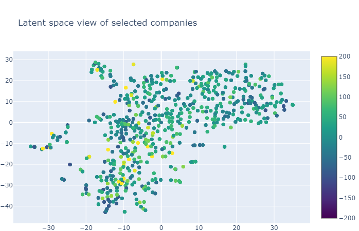

Nosputin is an integrated tool to analyze stock market data for each company with its fundamental data such as revenues and net income. 

## Description

**Nosputin** gives 4 application modes including **Data browser, Latent-View, Build model** and **Prediction**. After select any mode of **Nosputin, Nosputin** will load the stock market database from **Nosputin** database. You can adjust the range of the date of data using the sidebar.

### Data browser

**The Data browser** model will show the fundamental information for the selected individual stock. You can select a stock using a ticker of the stock. 

### Latent-view

**Latent-view** can show a 2-dimensional projection of fundamental data for each company using dimensionality reduction or manifold-learning algorithms. It allows the visual inspection that can check the distribution and similarity of the companies in terms of their financial statements such as revenue.

Note that since the dimension, the number of reported fundamental data has to be the same to show latent space of data. Therefore, we highly recommend that the date range to load stock market data should be as XXXX.01.01 to YYYY.12.31.

If you select the dimension of data, **Nosputin** will show the scatter plot with a 2-dimensional latent view and the performance during the selected date range.

### Build model

**Build model** will create the model that can predict the performance for each stock data using the machine learning-based implementation. This version uses several learning models to infer the performance from their fundamental data.

 Like **Latent-view**, the stock-prediction model only can predict the data that has the same dimensions because of the limitation of Gaussian process like any other machine learning-based technology. 

### Prediction
